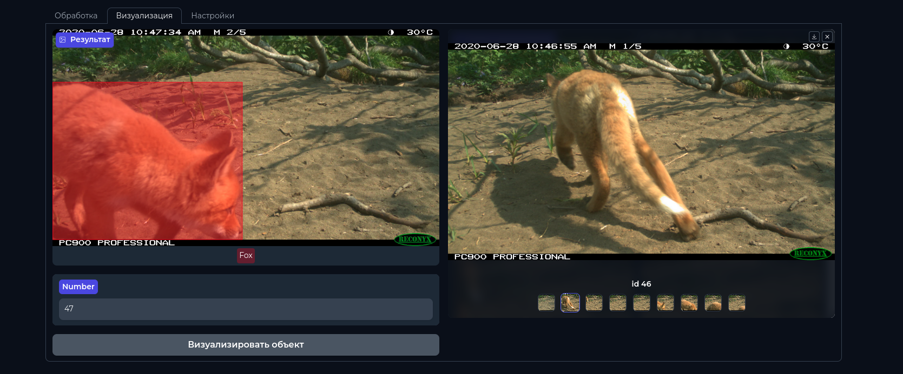

# Формирование регистраций животных

   

 

## Описание проекта

Этот проект представляет собой систему обработки изображений для фото ловушек с использованием Gradio и FastAPI. Он позволяет автоматически детектировать и классифицировать объекты на изображениях, а также визуализировать результаты.



## Содержание

- [Основные возможности](#основные-возможности)
- [Использование](#использование)
  - [Локальный запуск](#локальный-запуск)
  - [Запуск в Docker контейнере](#запуск-в-docker-контейнере)
  - [Переменные окружения](#переменные-окружения)
- [Структура проекта](#структура-проекта)
- [Лицензия](#лицензия)

## Основные возможности

- Запуск проекта в контейнере на любых машинах
- Выбор видов животных для учета
- Детекция и определение видов на фотографии
- Визуализация результатов в удобном интерфейсе
- Скачивание результатов в формате CSV

## Использование

### Локальный запуск

1. Установите виртуальное окружение:
    ```sh
    conda create -n animal_tracking python=3.9 -y
    conda activate animal_tracking
    pip install --upgrade pip  # поддержка PEP 660
    ```

2. Установите необходимые библиотеки:
    ```sh
    make build
    ```

3. Запустите веб-интерфейс на `localhost:8000`:
    ```sh
    python3 src/main.py
    ```

### Запуск в Docker контейнере

1. Выполните команду в терминале:
    ```sh
    docker compose up --build
    ```

2. При необходимости измените порты и переменные окружения в файле `docker-compose.yaml`.

### Переменные окружения

```sh
DATA_FOLDER = os.getenv("DATA_FOLDER", "data") # папка для временных файлов
SPICES_FILE = os.getenv("SPICES_FILE", "src/env/spices.json") # файл с видами
BATCH_SIZE = int(os.getenv("BATCH_SIZE", 32)) # кол-во файлов одновременной обработки
YOLO_PATH = os.getenv("YOLO_PATH", "weights/yolo.pt") # путь к весам
``` 

## Структура проекта

## Структура проекта

```python
animal_tracking
├── assests                 # Папка с ассетами, такими как изображения и другие статические файлы
├── data                    # Папка для хранения данных
├── weights                 # Папка с весами моделей
├── src                     # Исходный код проекта
│   ├── app
│   │   ├── gradio_app.py   # Основной файл приложения Gradio
│   │   └── utils.py        # Утилиты для приложения Gradio
│   ├── detection
│   │   ├── predict.py      # Файл для предсказаний детекции
│   │   └── utils.py        # Утилиты для детекции
│   ├── registration
│   │   ├──  predict.py     # Файл для регистрации
│   │   └── utils.py        # Утилиты для регистрации
│   ├── env
│   │   ├── env.py          # Файл для управления окружением
│   │   └── spices.json     # Файл с видами животных
│   └── main.py             # Главный файл для запуска приложения
├── docker-compose.yaml     # Конфигурация для Docker Compose
├── dockerfile              # Dockerfile для сборки образа
├── LICENSE                 # Лицензионный файл
├── makefile                # Makefile для автоматизации задач
├── README.md               # Файл с описанием проекта
└── requirements.txt        # Список зависимостей проекта
```

## Лицензия

Этот проект лицензирован под лицензией Apache 2.0. Подробности смотрите в файле [LICENSE](LICENSE).

---

Для получения дополнительной информации и инструкций, пожалуйста, обратитесь к документации или создайте issue в репозитории.